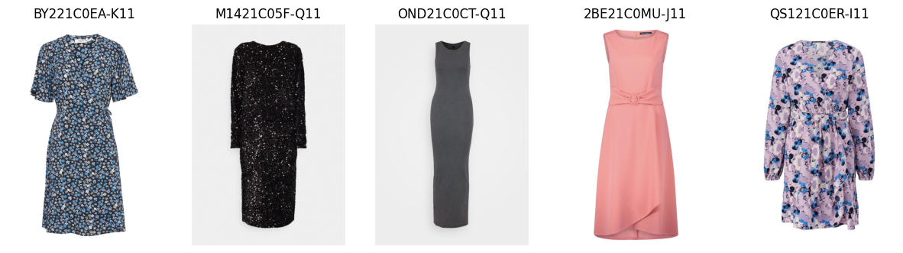
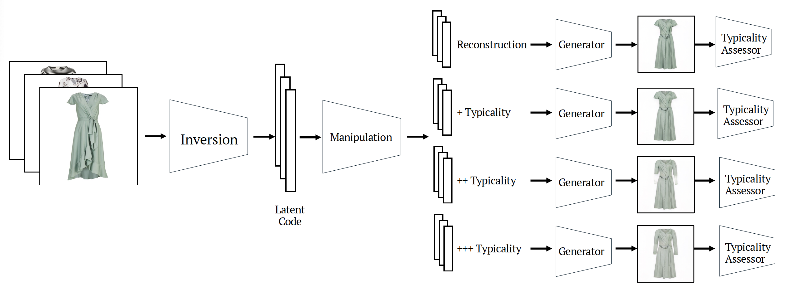
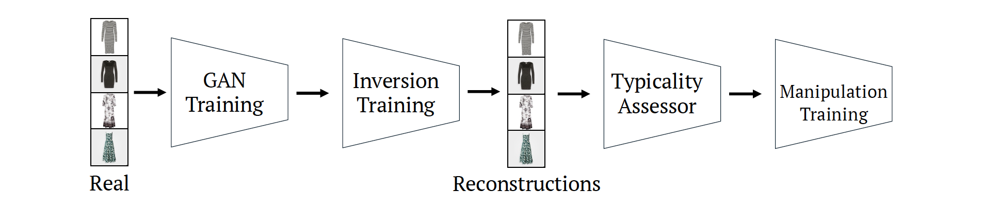
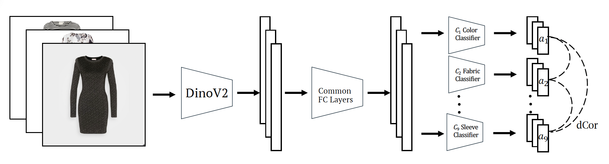
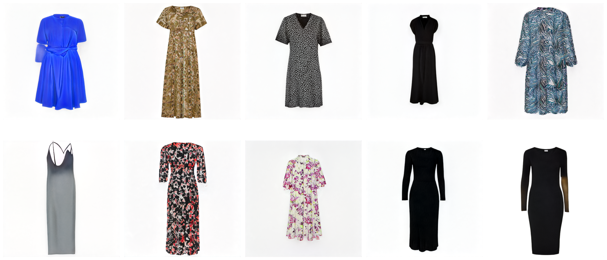
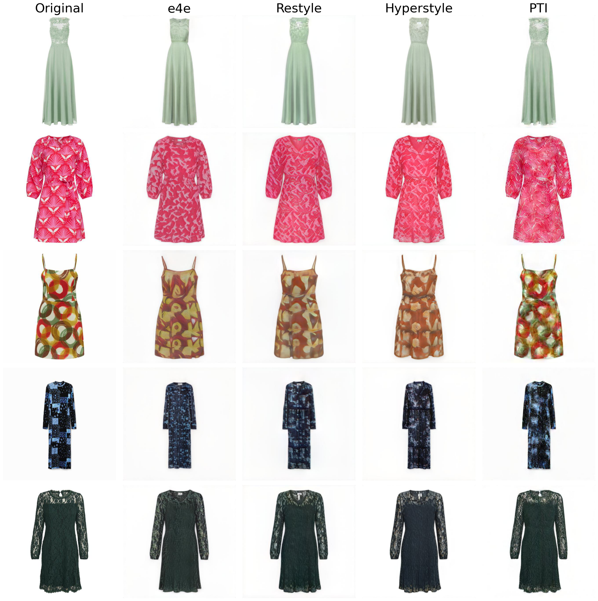
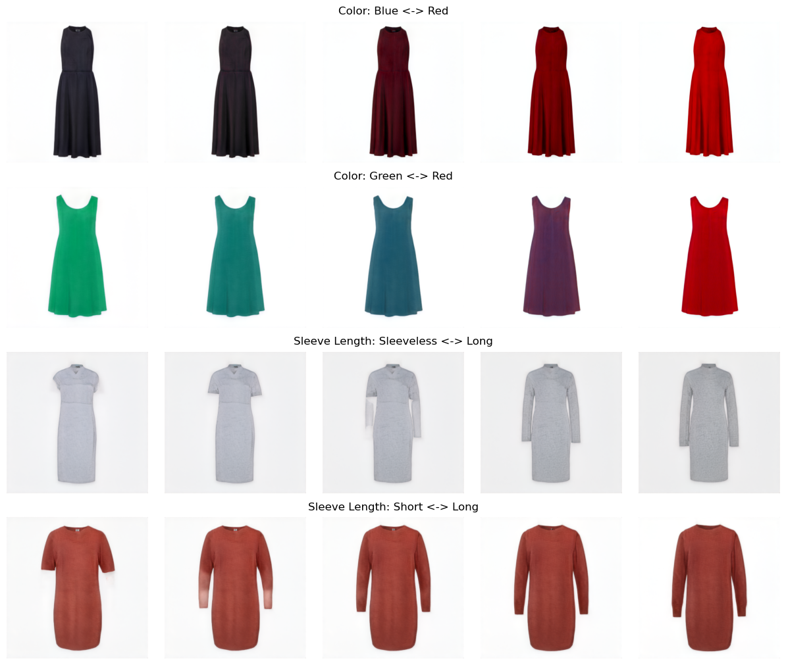
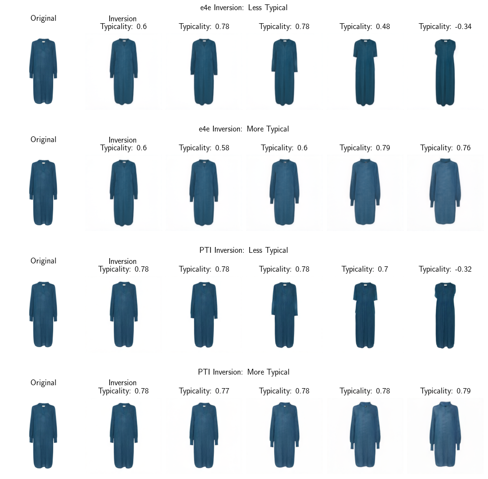
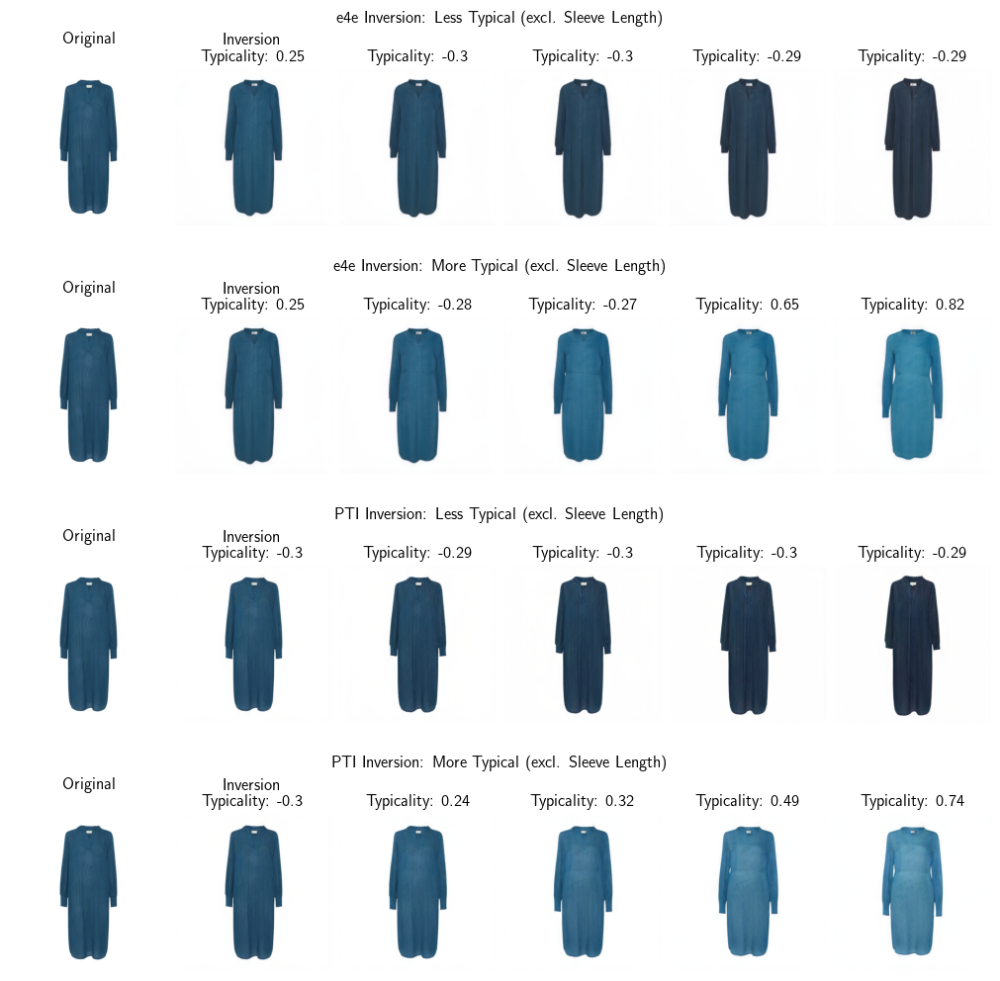

# Thesis

### Abstract:

The rapid evolution of generative adversarial networks (GANs) has significantly impacted various domains, including
fashion, where design typicality is a critical factor in consumer preference. This thesis presents a novel framework for
fine-grained, disentangled manipulation of visual attributes in fashion
images using generative adversarial networks. It leverages a StyleGAN2-Ada model trained on a custom dataset of over
14,000 dresses from Zalando—with transfer learning from FFHQ—to create high-fidelity images even from limited data. The
work systematically evaluates GAN inversion techniques, including encoder-based (e4e) and hybrid methods (PTI, ReStyle,
HyperStyle), to accurately reconstruct real images into a manipulable latent space. Two complementary typicality
measures are developed: one using pre-trained DINOv2 embeddings and another employing a disentangled embedding model
that isolates key aesthetic attributes such as color, fabric, and fit via distance correlation loss. By applying the
InterFaceGAN method, the thesis achieves controlled latent space manipulations that subtly adjust design typicality
while preserving overall image identity. Comprehensive evaluation using metrics like FID, IS, and LPIPS demonstrates the
potential of this approach to enhance fashion design by aligning products more closely with consumer preferences.

### Data

Curated from Zalando’s extensive dress collection, this dataset comprises over 14,000 high-quality images of women’s
dresses paired with rich article metadata. Only standardized, centered packshot images were retained and processed to a
uniform 1024×1024 resolution. The metadata focuses on key attributes such as brand, price, category, fabric, fit,
neckline, pattern, collar, length, shape, and sleeve length, ensuring reliable and clean labels.
In addition, color information was automatically extracted using a pre-trained CLIP model based on a fixed palette of 14
colors. Representing 643 unique brands, this dataset provides a diverse yet focused foundation for training advanced
generative models and performing fine-grained, disentangled visual attribute manipulation.

### Method

The method presents a modular pipeline that integrates high-fidelity image generation, robust inversion of real images
into the latent space, quantitative assessment of design typicality, and targeted latent space manipulation. This
workflow enables precise, disentangled editing of fashion images while preserving the core identity of the design.

In the generation stage, the approach leverages the StyleGAN2-Ada architecture to synthesize realistic dress images. A
transfer learning strategy from the FFHQ dataset, combined with data augmentations such as x-flip, ensures that the
model captures the nuanced aesthetics of the fashion domain. Evaluation metrics like FID, IS, and LPIPS guide the
selection of the optimal model checkpoint, balancing image quality and diversity.

The inversion phase maps real images into the latent space using state-of-the-art methods. An encoder-based model (e4e)
serves as the baseline, while hybrid approaches such as PTI, ReStyle, and HyperStyle are also explored. This step is
essential to accurately reconstruct images and maintain latent code editability for subsequent manipulation.

Typicality measures are computed using two complementary strategies. One approach employs pre-trained DINOv2 embeddings
to compare individual dress features to a composite morph, capturing an overall sense of typicality. The other approach
refines this assessment by learning disentangled sub-embeddings for key attributes—such as color, fabric, and fit—using
distance correlation losses, which together provide a robust and nuanced quantification of design typicality.

For latent space manipulation, the method utilizes InterFaceGAN to identify linear semantic boundaries corresponding to
design attributes. By traversing these boundaries, targeted adjustments can be made that subtly modify the typicality of
a design without disrupting its overall structure. This controlled editing mechanism allows for fine-grained
modifications that align the aesthetic attributes of fashion items with consumer preferences.

### Results

#### Generator Training

#### Inversion

#### Physical Attribute Manipulation

##### Typicality Manipulation

#### Disentangled Typicality Manipulation

The results demonstrate that the proposed framework successfully integrates high-quality image generation, robust
inversion, and precise attribute manipulation into a unified pipeline. The experiments confirm that the approach
achieves both visually realistic outputs and controlled, fine-grained edits aligned with design typicality.

In generator training, the StyleGAN2-Ada model, fine-tuned on the curated Zalando dataset, produces high-fidelity dress
images that closely resemble real-world samples. Quantitative metrics—such as FID, IS, and LPIPS—validate the quality
and diversity of the generated images, while visual samples further underscore the model’s ability to capture nuanced
fashion details.

Inversion experiments reveal that the selected methods, including the encoder-based e4e and hybrid approaches like PTI,
ReStyle, and HyperStyle, reliably map real images into a latent space suitable for subsequent manipulation. The results
highlight a balance between reconstruction accuracy and editability, ensuring that the latent codes maintain semantic
consistency while remaining amenable to targeted edits.

The typicality measures, computed using both pre-trained DINOv2 embeddings and a custom disentangled embedding model,
effectively capture the aesthetic attributes of each design. These measures provide a robust quantification of design
typicality, correlating well with perceptual evaluations and offering a solid foundation for supervised manipulation.

Finally, manipulation experiments using InterFaceGAN demonstrate that controlled latent space navigation can subtly
adjust the typicality of fashion images. By identifying and traversing semantic boundaries, the method achieves targeted
modifications that enhance or diminish design typicality while preserving the overall identity of the garment.

